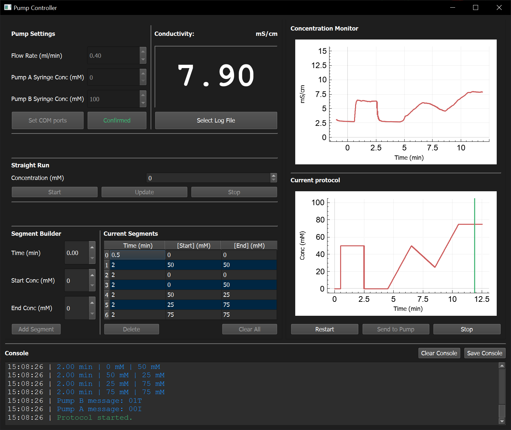

# Pump Controller

### Overview

I originally wrote this program for delivering different salt concentrations to *C. elegans* specimens, for stimulating the chemosensory ASE neurons. These neurons respond to changes in the concentration of soluble ions such as Na+ or Cl–. Past systems used a similar concept1 but were gravity fed and switching was between two fixed concentrations. 

Here, I am using two fixed concentrations as input to the system: one tube contains no salt, while the other has some arbitrarily high value (I usually use 100 mM NaCl). I then combine these two proportionally using a static mixer to generate a final delivered concentration. This means I can deliver various concentrations in an analog, rather than digital, manner. This setup affords a lot of flexibility in protocol design, and even allows for introduction of linear changes in salt concentration (as shown in the screenshot). It is not perfect, but it works pretty well! 

Although it was written for salt, you could feasibly use this with any soluble molecule. You would want to use some other feedback mechanism besides conductivity to validate your "concentrations" match expectations. I have used low concentrations of fluorescent dyes (e.g. TAMRA) and measured in the background, which works pretty well2.

### System setup

Hardware: 
* 2x [NE-1000X](https://www.syringepump.com/NE-1000.php) or [NE-1002X](https://www.syringepump.com/Micro.php)  syringe pumps (New Era)
* 1x [Fluidic 1460 Static Mixer (Darwin Microfluidics #CS-10001930; use the 600 um channel)](https://darwin-microfluidics.com/products/passive-herringbone-mixer-chip-channel-variation-mini-luer)
* 1x conductivity meter (I've tested with a ThermoFisher Orion Star A210 and eDAQ EPU357. [The latter is recommended](https://www.edaq.com/EPU357). 
* 1x flow-through conductivity meter, small volume (see note below). 
* 2x BD syringes, 20 mL (doesn't have to be these but it's what I have tested. You must set the syringe ID on the pumps; check the New Era manual). 
* 2x 90 mm length of [1/16" PEEK (0.03" inner diameter)](https://www.sigmaaldrich.com/US/en/product/supelco/z226955)
* 2x [Female Luer fitting for PEEK tubing](https://www.idex-hs.com/store/product-detail/female_luertight_fitting_system_for_1_16_od/p-835)
* Short lengths of [1/8" OD (1/16" ID) Tygon tubing](https://www.mcmaster.com/6516T11) for connecting the PEEK tubing to the mixer.
* A microfluidics device for imaging your worms... 

This software is compatible with both the New Era NE-1000 or NE-1002 models of syringe pumps. The NE-1002 has a finer step size that makes for smoother linear gradients. You should ideally get two of the same kind. You will need to also purchase the FW-1-X firmware upgrade to be able to use the linear ramp feature of this program, as well as the computer connection system, from New Era. 

*If you purchase the FW-2-X upgrade, it will allow you to create very complex protocols (maximum phases for the pump is 41 in the base or X1 firmware, and 340 for the X2 firmware).*

Note - the conductivity meter was originally purchased from Microelectrodes, Inc in Bedford, NH, but increased pricing for raw materials has led them to retire as of July 2025. The probe I had purchased was [this one](https://web.archive.org/web/20250423040243/https://www.microelectrodes.com/product-page/16-900-flow-thru-conductivity-electrode-with-1-16-fittings). I have not been able to find an alternative. I will update this if I can find one. 

A USB driver for the EPU357 conductivity meter (needed for use with Windows) can be [downloaded from here](https://web.archive.org/web/20240329124720/https://ftdichip.com/wp-content/uploads/2021/08/CDM212364_Setup.zip). 

### Installation

Connect your pumps and conductivity meter to a PC, ideally the one that runs your confocal microscope. Confirm the serial COM ports that these are connected at; you will need to supply these to the software. Download the latest version of the software and extract the ZIP file. Open up the PumpController EXE file. 

### Usage

Begin by clicking "Set COM ports" in the top left. Enter the correct COM ports for the pump and conductivity meter, confirm your meter model, and accept. Then, confirm the desired flow rate (I generally use 0.4 ml/min), and concentrations of Pump A and Pump B are correct and click Confirm. This locks the parameters. 

**NOTE** these pumps cannot be changed while they are operating. If you ever want to update anything, you must STOP the pumps first! 

#### Straight Run
This feature allows you to choose a desired concentration to flow and run this indefinitely. If you change this, stop the pumps, click update, and then run. I usually use this feature to equilibriate the pumps and flow at a holding concentration prior to an experiment. **You can start an experiment while this feature is operating!** It allows you to seamlessly transition from the pre-run phase to the experiment without having to stop the pumps. 

#### Segment Builder
Use this to build out an experiment. You can insert segments of either flat holds or linear gradients. Select a time, a starting concentration for that segment, and an ending concentration. The software will send the correct logic to the pumps to fit chosen paradigm. 

Entered segments appear in the list of segments next to this. You can select a segment and delete it without having to delete all of them. To insert a segment, you can select the segment above the space you wish to enter it, and then adding the segment will place it below your selected segment. 

When you are finished, ensure the pumps are stopped, then click "Send to Pumps". Make sure the pumps are done updating before you tell them to run! 

Generally, I start my experiments with a short holding period of the starting concentration. I begin collecting my images first, (while running using the "Straight Run" Feature), and then click "Start" after a certain number of frames. This allows me to precisely align the salt changes with the images by comparing the clock time for both processes. 

#### Current Protocol Graph

The "predicted" concentration changes your experiment will have, based on the segments you have entered, are shown here. While an experiment is running, a vertical green line shows where you are within the protocol. 

#### Concentration Monitor

An important feedback mechanism is the in-flow conductivity meter that shows how the concentration is changing in real time. The observed concentration, from -1 minutes until now, is shown here. While an experiment is running, the entire set of conductivity readings are logged. Once the protocol stops, this is cleared out (though the log is saved and can be exported with the "Save Log File" button). 

